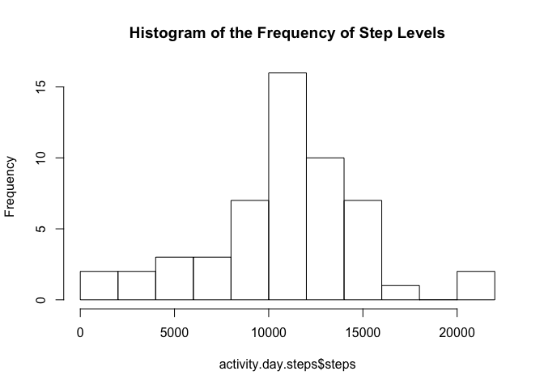
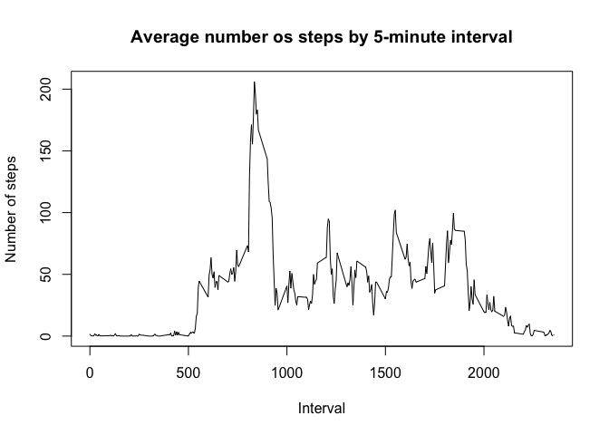
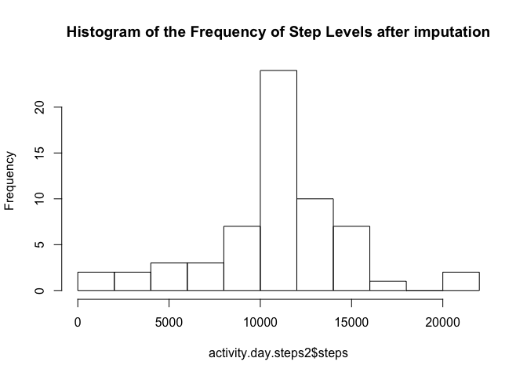

# Reproducible Research: Peer Assessment 1

## Loading and preprocessing the data
In this step, I load and pre-process the data into the activity project:

```r
setwd("/Users/triston/desktop/Data Science Work/RepData_PeerAssessment1/")
activity<-read.csv("activity.csv")
```


## What is mean total number of steps taken per day?
First, I sum up the number of steps per day, and then I create a historgram, and calculate the mean and the median of the aggregated data.


```r
activity.day.steps<-aggregate(steps ~ date, data=activity, FUN=sum)
hist(activity.day.steps$steps,breaks=10, main = "Histogram of the Frequency of Step Levels")
```

<!-- -->

```r
mean(activity.day.steps$steps)
```

```
## [1] 10766.19
```

```r
median(activity.day.steps$steps)
```

```
## [1] 10765
```


## What is the average daily activity pattern?
From here, let's take a look at what the pattern looks like over the course of the day, by the 5-minute interval data we have from the source data.


```r
activity.interval.steps<-aggregate(steps ~ interval, data=activity, mean)
plot(activity.interval.steps$interval, activity.interval.steps$steps,type="l", main = "Average number os steps by 5-minute interval", xlab="Interval", ylab="Number of steps")
```

<!-- -->

The interval with the most number of steps can be calculated by:


```r
activity.interval.steps[which.max(activity.interval.steps$steps),1]
```

```
## [1] 835
```

## Imputing missing values
I wonder if we're missing some values. Let's see.  I can use a sum(is.na()) function to figure that out.  Looks like the answer can be found pretty easily:


```r
sum(is.na(activity$steps))
```

```
## [1] 2304
```
Yep.  Let's impute those values; it could affect our analysis.

One easy approach to getting this data is to use the average interval time and use that for each NA value.  Let's do that now, summarize and compare these with the data above, which contains missing data.


```r
activity2<-activity
activity2$steps <- ifelse(is.na(activity2$steps) == TRUE, activity.interval.steps$steps[activity.interval.steps$interval %in% activity2$interval], activity2$steps)
activity.day.steps2<-aggregate(steps ~ date, data=activity2, FUN=sum)
hist(activity.day.steps2$steps,breaks=10, main = "Histogram of the Frequency of Step Levels after imputation")
```

<!-- -->

```r
mean(activity.day.steps2$steps)
```

```
## [1] 10766.19
```

```r
median(activity.day.steps2$steps)
```

```
## [1] 10766.19
```

## Are there differences in activity patterns between weekdays and weekends?
Now lets look at weekdays, first creating the variable in the activity2 dataset, and then using lattice to plot it out in panels:


```r
weekends.vector<-c("Saturday","Sunday")
activity2$weekday <- factor((weekdays(as.Date(activity2$date)) %in% weekends.vector), levels=c(FALSE, TRUE), labels=c('weekday', 'weekend'))

activity.interval.steps2<-aggregate(steps ~ interval+weekday, data=activity2, mean)
library(lattice)
xyplot(steps ~ interval | weekday, data = activity.interval.steps2, type = "l")
```

<!-- -->

Interesting to see that some of the spikes are the same in the morning, but differing patterns throughout the day.  I wonder what other patterns this data might hold...perhaps for a more motivated and excited analyst.  Could that be you?
